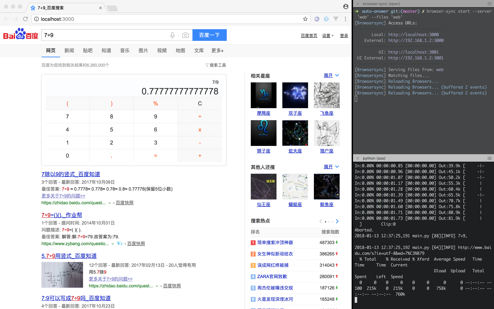

# auto-answer

自动答题的简单实现，演示：[YouTube](https://youtu.be/vdNGpVV65CM) 或 [腾讯视频](https://youtu.be/vdNGpVV65CM)。

## 使用方法

**以下仅在 `macOS` 上测试，其它平台需要做相应修改，可以参考后面其它介绍来自己构建**

需要预先安装以下工具：

- [sox](http://sox.sourceforge.net/) 用于录音。

```
brew install sox
```

- [Browsersync](https://www.browsersync.io/) 用于将搜索结果同步显示在浏览器上。

```
npm install -g browser-sync
```

- [Docker for Mac](https://www.docker.com/docker-mac) 由于 [讯飞语音听写](http://www.xfyun.cn/services/voicedictation) 的 SDK 没有 `macOS` 版本，所以这里使用了一个 `Ubuntu` 容器。

- [virtualenv](https://virtualenv.pypa.io/en/stable/) 用于生成独立的 `python` 运行环境。

```
pip install virtualenv
```

打开终端输入：

```
git clone https://github.com/shdxiang/auto-answer.git
cd auto-answer
docker build -t auto-answer .
docker run -td -v `pwd`/data:/root/data --name auto-answer auto-answer
browser-sync start --server 'web' --files 'web'
```

打开另一个终端输入：

```
cd auto-answer
virtualenv -p python3 env
. ./env/bin/activate
pip install pynput
python main.py
```

现在按住键盘左边的 `shift` 键并对着电脑说话，结束后松开 `shift` 键，可以看到类似下图结果：



## 原理

1. 录音到一个文件；

2. 使用 [讯飞语音听写](http://www.xfyun.cn/services/voicedictation) 将录音文件识别成文本；

3. 调用百度搜索这个句子；

4. 把搜素结果显示到浏览器。

## 录音

录音并保存到 `data/audio.wav`：

```
sox -d -p | sox -p -b 16 -r 16000 data/audio.wav remix -
```

## 识别

识别程序的源码 [recognizer.c](./recognizer.c) 是 [讯飞语音听写](http://www.xfyun.cn/services/voicedictation) 自带的例子作简单修改。

识别 `data/audio.wav`，即容器内的 `/root/data/audio.wav`：

```
docker exec auto-answer recognizer /root/data/audio.wav
```

## 搜索

搜索结果保存到 `web/index.html`：

```
curl -L -o web/index.html http://www.baidu.com/s?ie=utf-8&wd=XXXX'
```

## 结果显示

当 `web/index.html` 发生变化的时候，浏览器自动刷新：

```
browser-sync start --server 'web' --files 'web'
```
